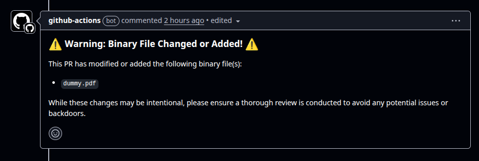

# binary-x9


## 🚨 The Binary Informer for Your Pull Requests

`binary-x9` is a simple **GitHub Action** that watches your pull requests like a hawk and **snitches on any added or changed binary files** — because sometimes, binaries in your codebase deserve a second look.

---

### Why `binary-x9`?

In Brazil, **“X9”** is slang for an **informer or snitch** — the one who tells the authorities about suspicious activities. This action plays the same role for your repo: it **doesn't judge or analyze binaries**; it simply **raises a flag** to alert reviewers that something binary and potentially suspicious just slipped into the PR.

---

### What does it do?

- Detects **added or modified binary files** in pull requests targeting your main branch.
- Posts a clear comment on the PR listing those binary files.
- Helps your team **stay aware and vigilant** about those “invisible” files that GitHub doesn't highlight well.
- Keeps your codebase safer by making reviewers notice potentially risky binaries early.

---

### Simple by design. Honest by nature.

This action is **not a malware scanner**. It's a **watchdog**, a **sentinel**, a **loud mouth** that tells reviewers:  
> *“Hey, this PR changed or added binary files. Double-check before you merge!”*


---

### Usage Example

```yaml
name: Binary File Change and New Binary Detection Example Repo

on:
  pull_request:
    branches:
      - main

permissions:
  issues: write
  pull-requests: write

jobs:
  binary-check:
    runs-on: ubuntu-latest
    steps:
      - uses: actions/checkout@v4

      - name: Run binary file detection action
        uses: lucasbalieiro/binary-x9@v1.0.0
        with:
          github_token: ${{ secrets.GITHUB_TOKEN }}
```

---

### Inputs

| Input         | Required | Description                           |
| ------------- | -------- | ----------------------------------- |
| `github_token`| Yes      | GitHub token to post PR comments    |

---

### Why should you care?

Because **binary files hide secrets, backdoors, and surprises** that can break your build or worse — compromise your security. GitHub’s UI is *too quiet* about them, but `binary-x9` will make sure **no binary goes unnoticed.**

This idea was sparked by the infamous [Xz Utils backdoor incident](https://en.wikipedia.org/wiki/Xz_utils#Backdoor_incident), where a malicious binary slipped into a widely used project — highlighting how "easy" it is for dangerous binaries to hide in plain sight.

The inspiration solidified when reviewing this PR:  
[https://github.com/stratum-mining/stratum/pull/1760#pullrequestreview-2950763360](https://github.com/stratum-mining/stratum/pull/1760#pullrequestreview-2950763360)

---

### How it works

`binary-x9` uses a simple trick leveraging Git’s built-in diff command:

We run:

```bash
git diff --numstat origin/$GITHUB_BASE_REF
```

According to [Git’s documentation](https://git-scm.com/docs/git-diff#Documentation/git-diff.txt-code--numstatcode), this command outputs a numeric summary of changes for each file:

* For regular text files, it shows the number of added and deleted lines.
* For **binary files**, it outputs two dashes (`-`) instead of numbers (like `-    -    path/to/binary`).

The action then uses a straightforward `awk` script to **detect files with those dashes**, effectively flagging binaries.

It’s simple, it’s dumb, and it’s exactly what it needs to be — no deep analysis, just a sharp eye on your PR’s binary files.
